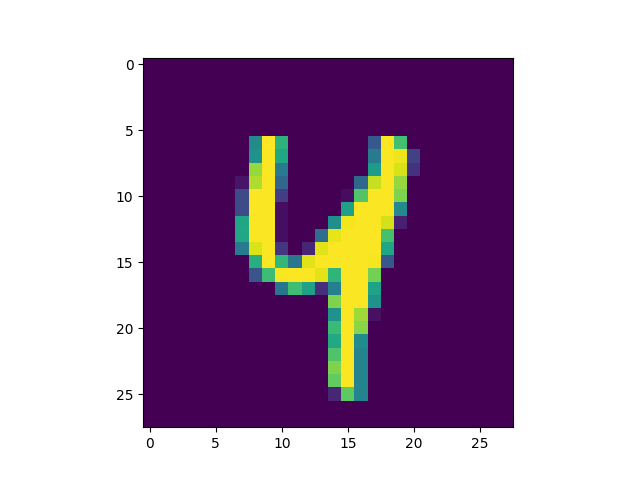
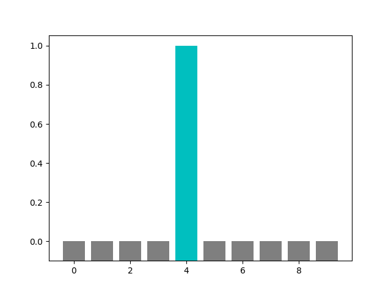

# Feb 5 Informal Response

## Question A

We split the data into a training set and a testing set to ensure that the model does not overfit, i.e. it can handle data that it has not seen before. 

## Question B

The `relu` function sets the negative output of each neuron to 0 in order to prevent the negative output from potentially skewing the results downstream. The `softmax` function sets the label with the highest probability to 1 and all others to 0 in order to match each image with a single label. The last layer has 10 neurons because we specify 10 labels. 

## Question C

The loss function translates the objective into a numerical value that we want to reduce, while the optimizer provides the direction where the program should go next in order to reduce the loss function. 

## Question D

1. There are 60000 images, and their dimensions are 28 by 28

2. The length of the labels training set is 60000

3. There are 10000 images, and their dimensions are 28 by 28

4. See [the script](20210205.py)

5. The selected test image is categorized as 4

6. The selected test image and its corresponding histogram are displayed below: 

  
Selected Test Image

  
Corresponding Histogram  

[Script for this excercise](20210205.py)
