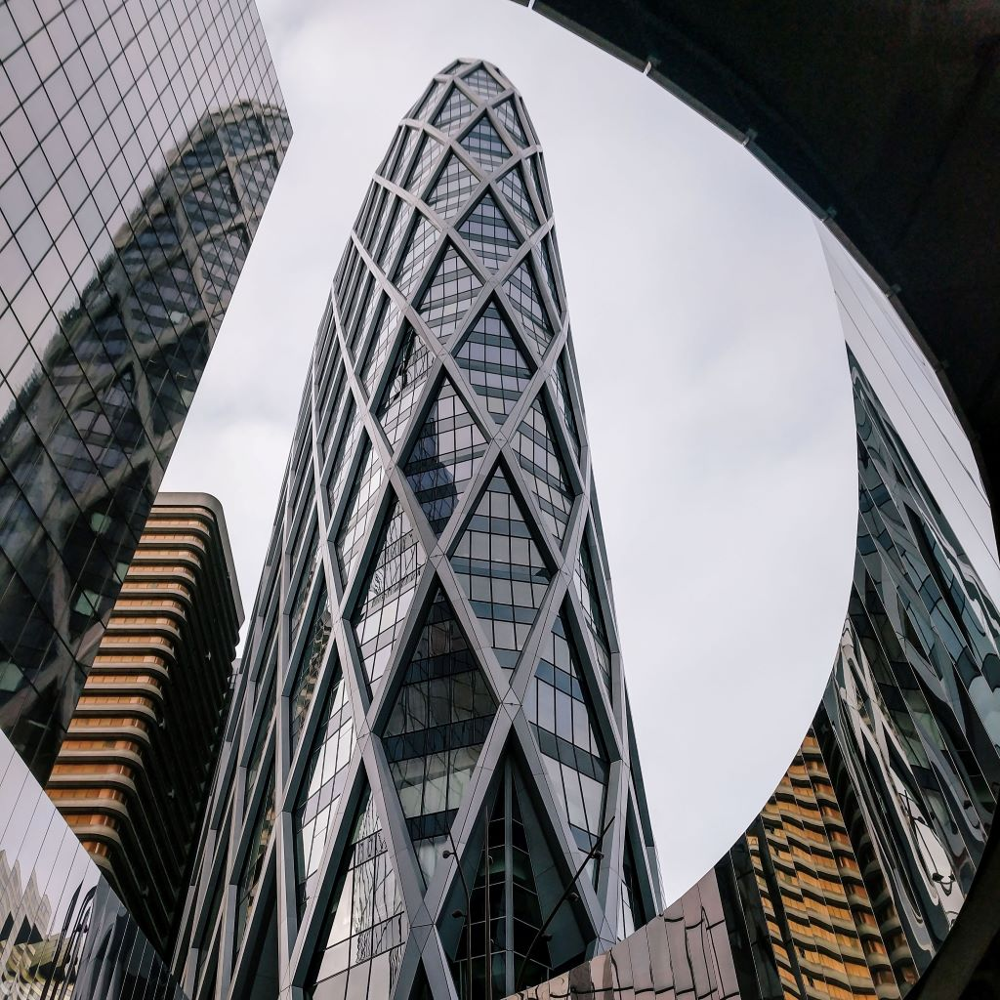
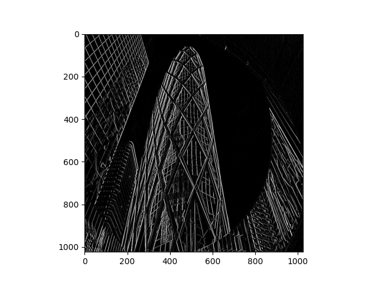

# Feb 21 Informal Response (Convolution and Pooling)

## Question A

The image I selected is a photo of buildings, as shown below: 

The first filter I selected is the in-class filter: 

The resulting image is: 

