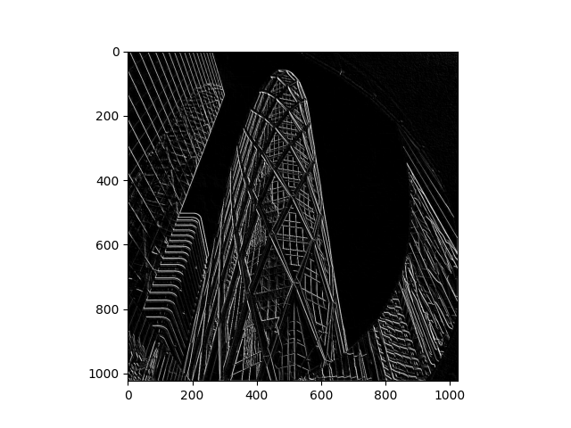

# Feb 21 Informal Response (Convolution and Pooling)

## Question A (Convolution)

The image I selected is a photo of buildings, as shown below: 

The first filter I selected is the in-class filter: 

The resulting image is: 

This filter accentuates the vertical boundaries in the image. Because the image mainly consists of vertical edges, this filters works very well. 

The second filter I selected is the following: 

The resulting image is: 

This filter accentuates the horizontal boundaries in the image. Because the main building in the image does not include many horizontal edges, this filter does not give a good result. 

The third filter I selected is the following: 

The resulting image is: 

This filter accentuates the top-left to bottom-right diagonal boundaries in the image. Because the image includes many diagonal edges in this direction, this filter also works very well. 

Functionally, the filters alter the value of each pixel by weighting and adding up its and its neighbors' values. 

Convolving filters are important because they can help detect the outlines of objects. 

## Question B (Pooling)

Next I modify the output from the third filter with pooling, the resulting image is: 

