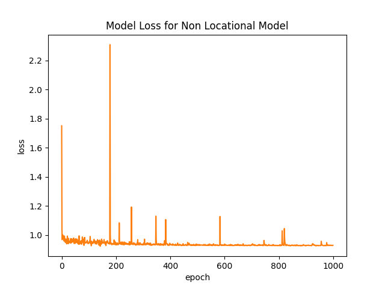
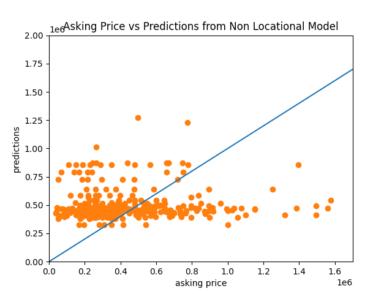
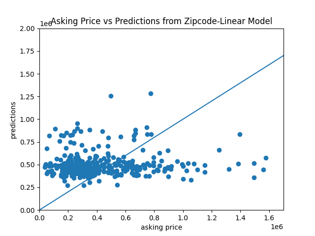
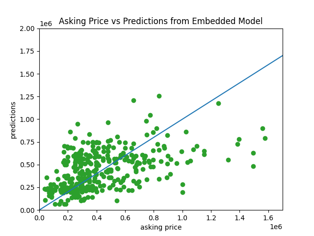
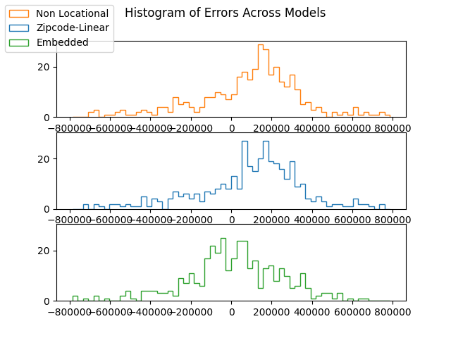
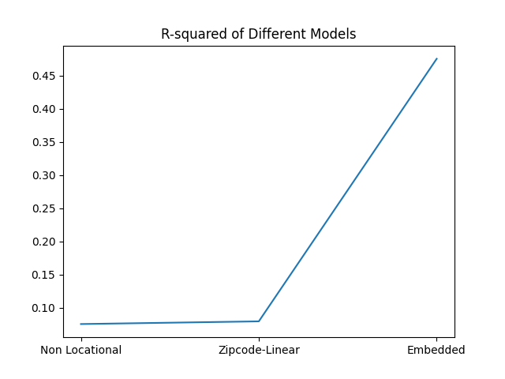
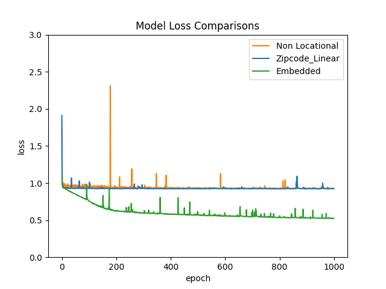

# Project 1 - Housing Price Prediction

This is a report on Project 1, housing price prediction. In this report, I will describe the data, specify the model, analyse the model output,
and then rank the homes from best to worst deal. I will also include two ways of implementing the zipcode of each home's address as a spatial variable, 
and compare those two models' predictive power to the first model. 

## Data

The data I used for this project is scraped from Zillow on Friday, Feb. 2, 2021 with a [scraping script](zillow_scrape.py). I scraped 400 homes listed on 
Zillow in the city of New Orleans, Louisiana, each of which is represented by an observation in the dataset. The variables included are the listing price 
(`prices`), number of bedrooms (`no_beds`), number of bathrooms (`baths`), square footage (`sqft`), and zipcode (`zip`). I then dropped any observations 
with any unavialable data, which left the dataset with 386 observations. 

## Model

The first model I specify (called Non Location Model below) uses number of bedrooms (`no_beds`), number of bathrooms (`baths`) and square footage (`sqft`) to 
predict listing price (`prices`). The model is a sequential model with an input layer that takes the input shape of `(3,)`, followed by a dense layer with 3 
units and no activation function, then ending with a dense layer of 1 unit and no activation function. I used stochastic gradient descent as the optimizer and 
mean squared error as the loss function. The model is trained over 1000 epochs. 

## Output

The model has a mean squared error of `316130503376.13`, a mean absolute error of `311911.26` and an R-squared statistic of `0.0751`. This means only 
7.51% of the variation in the prices can be explained by the model. 

The model loss over the epochs can be seen below: 

Here we can see that although there are fluctuations, the loss function seem to stop trending downwards after approximately 200 epochs. Intuitively, this means 
that the model has stopped learning after about 200 epochs of training. 

The following graph is a histogram of the errors: 

Here we can see that although the histogram has a vaguely bell-like shape, the peak is above 0, meaning that the predictions of the model are biased towards 
overestimating the prices. 

Finally, the scatterplot of prediction prices vs actual asking prices: 

Here, the scattered points do not seem to converge near the 45 degrees trend, meaning the prediction prices are very different from the actual asking prices. 

## Deal Assessment

By the model's prediction, the listing prices range from 1283026.66 dollars underpriced to 4102612.95 dollars overpriced. The deals can be ranked by sorting the errors. 

## Zipcode as Spatial Variable

I specified two models to use zipcode of each home as a spatial variable in the model. 

### Zipcode-Linear Model

In the first model with zipcode, I treat the zipcode as a numeric data alongside `no_beds`, `baths` and `sqft`. Hence, the structure of this model is identical to the 
Non Locational Model except the input layer takes the shape of `(4,)`, and the first dense layer has 4 units. I call this the Zipcode-Linear Model, because this model 
assumes the zipcode numbers has a linear relationship to the listed prices. 

Here is the scatterplot of prediction prices vs actual asking prices: 

The scattered points do not seem to converge near the 45 degrees trend, meaning the prediction prices are very different from the actual asking prices. 

### Embedded Model 

However, zipcode are not numerical values. Instead, they are categorical. To treat categorical data, I used an embedding layer. I generated a new variable `code`
which goes from 0 to 16, each integer corresponding to a unique zipcode. The model, which I call the Embedded Model is structured in the following way: 

1. The model takes the categorical variable (`code`) and the numerical variables (`no_beds`, `baths`, `sqft`) seperately. 
2. The numerical variables are passed through an input layer of shape `(3,)`.
3. The categorical variable is passed through an input layer of shape `(1,)`.
4. The categorical variable is passed through an embedding layer with an input dimension of 17 and an output dimension of 10 and an input length of 1. The input dimension 
corresponds to the number of existing categories, and the input length indicates the number of categorical variables. The output dimension is a hyperparameter that I set 
arbitrarily. 
5. The categorical variable is then passed through a flatten layer. 
6. The categorical and numeric variables are combined through a concatenate layer
7. The variables are passed through a dense layer of 13 units (10 output dimensions from the embedding layer + 3 numerical features) with a `'relu'` activation function. 
8. Finally, an output dense layer of 1 unit with no activation function. 

Here is the scatterplot of prediction prices vs actual asking prices: 

The scattered points seem to converge near the 45 degrees trend much better, meaning the prediction is more favorable than the other two models. 

### Model comparisons

Below are some statistics from the three models: 

| |MSE|MAE|R-squared|
|:-:|-:|-:|-:|
|Non Locational Model|316130503376.13|311911.26|0.0751|
|Zipcode-Linear Model|314739937829.11|313238.34|0.0792|
|Embedded Model|179354715936.14|233520.94|0.4753|

And here are these statistics visualized: 

We can see that while the performance of Non Locational Model and Zipcode-Linear Model are similar, the Embedded Model results in significantly lower MSE and MAE and higher 
R-squared. This is because zipcode is a categorical data, so in the Zipcode-Linear Model where it is treated as a numerical data, the inclusion of zipcode as a spatial variable
does not increase performance. 

Then we can compare the model loss: 

Both the Non Locational and Zipcode-Linear models appear to have no trend after approximately 200 epochs, while the Embedded model appear to maintain a downward trend across 
all 1000 training epochs. 

And finally, the error histogram (with extreme outliers excluded): 

Although all three models feature vaguely bell-shaped error histogram, the peaks of Non Locational and Zipcode-Linear models are significantly higher than 0, while the peak of 
the Embedded Model occurs near 0. This means that the Embedded model is more unbiased than the other two models. 

## Scripts
[Scraping Script](zillow_scrape.py)

[Project Script](project_1.py)
