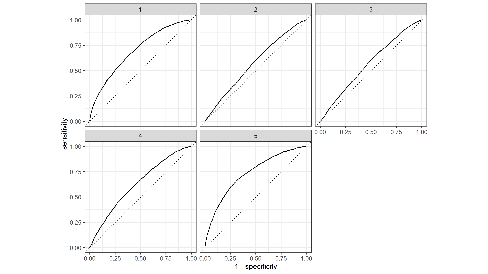
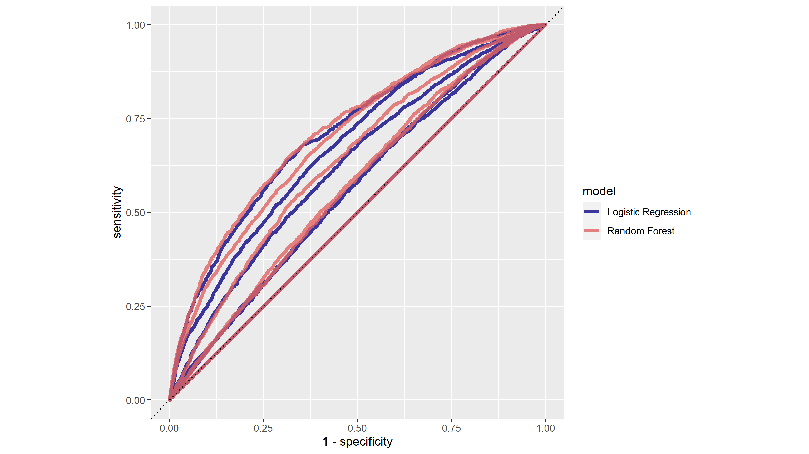

# Project 2 Response - DHS Wealth Prediction

This is a report on Project 2. In this project, I use the DHS survey data on Jordan to predict individual's wealth level. The variables age (`age`), education level (`edu`), gender (`gender`) and family size (`size`). 

## Penalized Logistic Regression

The first model used is penalized logistic regression. The 30 penalty values is in a geometric sequence that starts with 0.0001 and ends with 0.1. The common ratio is therefore approximately 1.27. Across the penalty values, the top 15 that results in the largest areas under the ROC curve are: 

```
penalty .metric .estimator  mean     n std_err .config              
      <dbl> <chr>   <chr>      <dbl> <int>   <dbl> <chr>                
 1 0.0001   roc_auc hand_till  0.621     1      NA Preprocessor1_Model01
 2 0.000127 roc_auc hand_till  0.621     1      NA Preprocessor1_Model02
 3 0.000161 roc_auc hand_till  0.621     1      NA Preprocessor1_Model03
 4 0.000204 roc_auc hand_till  0.620     1      NA Preprocessor1_Model04
 5 0.000259 roc_auc hand_till  0.620     1      NA Preprocessor1_Model05
 6 0.000329 roc_auc hand_till  0.620     1      NA Preprocessor1_Model06
 7 0.000418 roc_auc hand_till  0.620     1      NA Preprocessor1_Model07
 8 0.000530 roc_auc hand_till  0.619     1      NA Preprocessor1_Model08
 9 0.000672 roc_auc hand_till  0.618     1      NA Preprocessor1_Model09
10 0.000853 roc_auc hand_till  0.618     1      NA Preprocessor1_Model10
11 0.00108  roc_auc hand_till  0.617     1      NA Preprocessor1_Model11
12 0.00137  roc_auc hand_till  0.615     1      NA Preprocessor1_Model12
13 0.00174  roc_auc hand_till  0.614     1      NA Preprocessor1_Model13
14 0.00221  roc_auc hand_till  0.612     1      NA Preprocessor1_Model14
15 0.00281  roc_auc hand_till  0.609     1      NA Preprocessor1_Model15 
```
Here we can see that the models with penalty values 0.0001, 0.000127, and 0.000161 has the largest AUC, being 0.621. 

The AUC to penalty curve can be found below. Note that the x-axis is not in a linear scale, equidistant points on the x direction share the same ratio in penalty values instead of difference. 


It appears that the AUC gradually decreased from the first model (penalty value = 0.001) to the 21st model (penalty value = 0.0117210), and stayed steady towards the 24th model (penalty value = 0.0239503), after which the AUC dropped significantly, then stayed steady again from the 27th model (penalty value = 0.0489390) to the 29th model (penalty value = 0.0788046). From this, I think the irrelevant predictors are gradually removed from the model throughout the first to 21st model (penalty value from 0.001 to 0.0117210), after which relevant predictors were removed from the model, resulting in significant drops in the AUC. 

I choose the penalty value of 0.000853168 (the 10th model) because it is represented by the last point in the plot that belongs to the initial gradual descent in AUC. 

The ROC plot of the model is as follows: 


Here we can see that the model handles the wealth level 5 best, and predicts wealth levels 1 and 4 with good results, but is not as effective at predicting wealth levels 2 and 3. 

## Random Forest

The second model used is random forest.The random forest models all contain 1000 trees, between 1 and 4 predictors are randomly selected, and the minimal node size vary from 1 to 40. Below are the AUC values with their corresponding number of randomly selected predictors and minimal node size. 


We can then trace the general outline of AUC against minimal node sizes with different number of randomly selected predictors: 


Here we can see that generally speaking, models with 2 randomly selected predictors seem to work best, followed by models with 1 randomly selected predictor, then 3 and 4. Models with any number of predictors seem to increase in effectiveness as minimal node size gets close to 40, with the exception of models with 1 randomly selected predictor showing a slight downward trend. The top model is: 

``` 
   mtry min_n .config              
  <int> <int> <chr>                
1     2    37 Preprocessor1_Model12
``` 



The prediction outcomes appear to exhibit the same behavior as the penalized logistic regression model, having good performance in wealth levels 1, 4 and 5 but limited performance in wealth level 2 and 3.



Here we can see that the best random forest model perform slightly better than the best penalized logistic regression model. 

Since we have found above that the best model seems to have 2 predictors and minimal node size close to 40, we can specify another random forest model with 1000 trees, 2 randomly selected predictors and a minimal node size of 40. 

``` 
last_rf_mod <-
  rand_forest(mtry = 2, min_n = 40, trees = 1000) %>%
  set_engine("ranger", num.threads = cores, importance = "impurity") %>%
  set_mode("classification")
``` 
Then we can produce a plot of the importance of each predictor: 


Therefore, the most important predictors are education level and age, with the family size following, and gender has relatively low importance. 

## Logistic Regression

The third model used is logistic regression. First I use age, gender, education level and family size as predictors to predict the different wealth levels. Below are several model evaluation metrics across different target levels: 

|Wealth Level| Accuracy |     Loss |      AUC |
|:----------:| --------:| --------:| --------:|
|           1| 0.7245576| 0.5577476| 0.6812093|
|           2| 0.7586665| 0.5489602| 0.5604080|
|           3| 0.7965463| 0.5033618| 0.5474337|
|           4| 0.8458242| 0.4170481| 0.6298179|
|           5| 0.8921884| 0.3148832| 0.7072637|

Then I added the cross feature between age and education level to account for any generational difference in the return of education. Below are several model evaluation metrics across different target levels:

|Wealth Level| Accuracy |     Loss |      AUC |
|:----------:| --------:| --------:| --------:|
|           1| 0.7258431| 0.5581085| 0.6807461|
|           2| 0.7586665| 0.5492049| 0.5597088|
|           3| 0.7965463| 0.5031614| 0.5501173|
|           4| 0.8458242| 0.4167804| 0.6292948|
|           5| 0.8916313| 0.3147979| 0.7066786|

Incorperating the cross feature seems to have mixed results across the board in all metrics. However, the impact is insignificant. 

The ROC curves of the models with cross features are displayed below. Still, this model has a larger AUC for wealth levels 1,4 and 5 while lacking in levels 2 and 3. 


## Gradient Boosting

