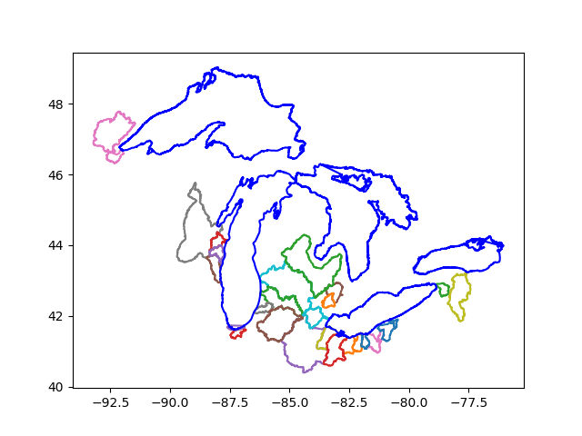

# Project 4 Response - Final Project Proposal

## Problem Statement

With the ability to enter almost every crevice of the world and withstand natural degradation, microplastics is a rising problem in environmental protection. One of the ways microplastics enter the natural environment is through the surface runoff, as can be seen by the increase of microplastic concentration in rivers after runoff events such as rain or storm. In this project, I will analyze some factors that determine the increase of microplastic concentration in rivers after runoff events such as population, night time light, the prescence of natural reserves, and traffic systems in the Great Lakes region. 

## Data Description

The microplastic concentration data is accessed through USGS [here](https://www.sciencebase.gov/catalog/item/5748a29be4b07e28b664dd62). I have mapped the collection sites to their corresponding HUC8 hydrologic units as an approximation of their watershed area. Different collection results with the same hydrologic condition ("low-flow" versus "runoff-event") has been averaged with their sample water volumn as weights, and sites that belong to the same HUC8 hydrologic unit are also combined using the same weighted averaging. The resulting map can be seen below: 

